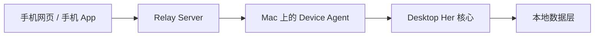
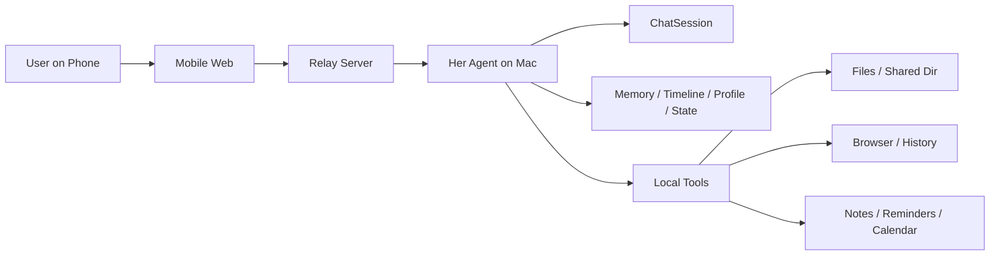

# Her System Overview

## 1. Her 是什么

Her 不是一个普通的 AI 聊天壳，也不是一个“工具很多”的桌面助手。

Her 的目标是：

- 持续记住用户
- 理解用户最近在过什么生活
- 把聊天、文件、图片、视频、待办、日历、浏览内容串成同一条时间线
- 在合适的时候像“那个一直在的人”一样接上用户

一句话定义：

**Her = 一个以记忆和连续性为核心的本地 AI companion。**

Her 最重要的不是单轮回答质量，而是：

- 你今天做过什么，她记得
- 你之前交代过什么，她记得
- 你发过什么图、下载过什么视频、生成过什么文件，她记得
- 你喜欢怎么被回应、最近在纠结什么，她也记得

## 2. 项目的核心原则

这个项目当前最重要的产品原则有 4 条：

1. `记忆优先`
   Her 的竞争力来自连续性，不来自功能堆砌。

2. `本地优先`
   用户的原始数据尽量只留在自己的 Mac 上。

3. `理解高于展示`
   Her 不应该只是“知道你看了什么”，而应该能围绕这些内容和你自然聊起来。

4. `克制`
   Her 不应该像监控面板或远程控制器，而应该像一个稳定、持续、不过界的存在。

## 3. 当前系统由哪三层组成

Her 现在可以理解为三层：

### A. Desktop Her

运行在用户自己的 Mac 上，是 Her 的真正主体。

它负责：

- 对话主脑
- 记忆
- 画像和状态
- 时间线
- 本地文件
- 图片 / 视频 / artifact
- 浏览器上下文
- 浏览历史演化
- 提醒 / 日历 / 待办
- 下载媒体
- 本地通知

一句话：

**Desktop Her 是真正“活着”的 Her。**

### B. Relay Server

运行在服务器上，只负责中转，不保存用户的原始生活数据。

它负责：

- 手机网页入口
- WebSocket 转发
- Mac Agent 在线状态
- 手机请求转发给本地 Her
- 把本地 Her 的结果回给手机

它不负责：

- 保存浏览历史原文
- 保存 Notes 原文
- 保存文件内容
- 替代本地 Her 做所有事情

一句话：

**Relay 只是一个转发站，不是 Her 的主脑。**

### C. Local Device Agent

这是运行在 Mac 上、由 Desktop Her 挂出来的一层远程访问接口。

它负责：

- 主动连接 relay server
- 暴露少量结构化远程能力
- 把远程请求转给本地 ChatSession / Memory / Timeline / Tools
- 把结果结构化回传

一句话：

**Device Agent 是手机和本地 Her 之间的桥。**

## 4. 整体架构

更具体一点：

## 5. 数据边界

这是整个项目最重要的边界之一：

### 原始数据只留在 Mac

包括：

- conversation history 原始存储
- memory 原始内容
- 浏览历史原文
- 当前浏览器页面细节
- Apple Notes 原文
- Reminders / Calendar 原始事件
- 文件路径
- 桌面 / Downloads 细节
- 本地 artifact 文件

### 服务器只转发，不做原始数据仓库

服务器当前只知道：

- 有没有 agent 在线
- 设备名
- 支持哪些远程能力
- 当前请求和响应

这意味着：

**Her 的“真相源”是用户自己的 Mac，而不是云端数据库。**

## 6. 现在已经打通了什么

当前已经落地的远程能力有：

1. `chat.send`
   手机可以把消息发给本地 Her，由本地 Her 真正回答

2. `timeline.today`
   手机可以问“我今天干了什么”

3. `context.current`
   手机可以问“我现在电脑上在看什么 / 在干嘛”

4. `artifact.recall`
   手机可以找回最近文件、图片、视频等 artifact

5. `media.download`
   手机可以让本地 Her 下载媒体，然后回传结果

当前 relay 已经支持：

- client websocket
- agent websocket
- 在线状态
- 请求转发
- 健康检查

## 7. 当前远程 MVP 的目录

### 本地 Mac 侧

- `src/core/remote/device-agent.js`
  本地 agent，负责连 relay

- `src/core/remote/remote-dispatch.js`
  把远程动作映射到本地能力

- `src/core/remote/remote-events.js`
  统一远程消息类型

- `src/core/remote/remote-serializer.js`
  远程返回的结构化序列化层

- `src/main/context-reader.js`
  共享读取前台 app / Calendar 的 helper

### 服务器侧

- `remote-server/server.js`
  relay server

- `remote-server/public/index.html`
  最小手机网页

- `remote-server/public/app.js`
  手机网页逻辑

- `remote-server/public/styles.css`
  手机网页样式

- `remote-server/README.md`
  relay 启动说明

## 8. 当前请求链路怎么走

### 例子 1：手机问“我今天做了什么”

1. 手机网页发 `job.request`
2. relay 收到后转发给 Mac 上的 agent
3. agent 调本地 `timeline.today`
4. 本地 Her 从 memory timeline / todo / today events 里整理结果
5. relay 把结果回给手机

### 例子 2：手机问“我现在电脑在看什么”

1. 手机网页发 `context.current`
2. relay 转给本地 agent
3. 本地 agent 调当前页面读取逻辑
4. 返回 front app、current page、calendar、todos、environment snapshot
5. 手机显示结果

### 例子 3：手机发普通消息

1. 手机网页发 `chat.request`
2. relay 转给本地 agent
3. agent 调本地 `ChatSession.sendMessage()`
4. 本地 Her 结合记忆、状态、时间线、本地上下文生成回复
5. relay 把最终答复回给手机

## 9. 这套方案为什么比“服务器 + ssh 回电脑”更适合 Her

之前那种思路更像：

`手机 -> 服务器 -> ssh -> 用户电脑`

那样的特点是：

- 服务器是主脑
- 本地能力是临时 ssh 进去拿
- 更像远程控制器
- 更像运维方案

而现在这套是：

`手机 -> relay -> Mac 上的 Her Agent -> Desktop Her`

这样做的好处是：

- 本地 Her 才是真正主体
- 本地上下文是长期在线能力，不是临时 ssh 进去查
- 服务器只是转发站
- 更符合 Her “连续在场”的产品逻辑

一句话：

**不是服务器替代 Her，而是手机远程访问你 Mac 上的 Her。**

## 10. 当前还没做完的部分

虽然远程闭环已经通了，但现在还只是 MVP。

还没做的包括：

### 1. 桌面端远程设置 UI

现在远程配置虽然已经有 store 和 IPC，但还没有正式设置页。

后面要补：

- relay url 输入
- agent enable 开关
- device token 配置
- 当前连接状态展示

### 2. HTTPS / 域名

现在 relay 还只是端口访问。

后面应该补：

- 域名
- HTTPS
- 更正式的 token / auth 流程

### 3. 更丰富的远程能力

后面可以继续加：

- today + calendar 整理
- reminder 远程回顾
- notes summary
- browser digest
- artifact 直接回传下载链接 / 文件

### 4. 更正式的身份和设备管理

当前是单用户、单设备导向。

后面如果要产品化，需要：

- 账号体系
- 多设备管理
- token 轮换
- 更细的权限控制

## 11. 为什么这件事重要

Her 的难点不是“模型更强”，而是：

- 她要持续记住你
- 她要知道你电脑上正在发生什么
- 她要让手机上的你，仍然能找到“同一个 Her”

这个远程方案的价值就在于：

**它没有把 Her 变成一个普通云聊天工具。**

相反，它保留了 Her 最重要的东西：

- 本地记忆
- 本地上下文
- 本地 artifact
- 本地时间线
- 本地连续性

而手机只是多了一个入口。

## 12. 当前状态总结

截至当前，这个项目已经有了三件关键东西：

1. `Her 本地核心`
   已经具备连续记忆、时间线、artifact、理解层、通知和上下文能力

2. `本地 Agent`
   已经能把本地 Her 暴露为远程结构化能力

3. `Relay + Mobile Web`
   已经能从手机打到你的 Mac 上的 Her

所以从架构角度讲，现在这个项目不再只是桌面端 AI，而是：

**一个以 Mac 为真相源、可被手机远程访问的本地 AI companion 系统。**

