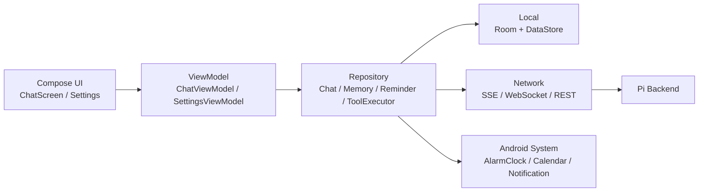

# Pi Android

Pi 是一个基于 Android 的本地 AI 助手客户端，支持：

- 流式聊天（SSE）
- 后台推送（WebSocket + 前台服务）
- 本地工具执行（记忆、提醒、系统闹钟、日历事件）
- 本地数据持久化（Room）
- API Key 管理与版本更新检查
- 图片输入（相机/相册，多图）

当前仓库为单模块 Android 项目（`app`），技术栈以 `Jetpack Compose + Hilt + Room + OkHttp` 为核心。

## 1. 功能概览

- 聊天与流式输出
- 通过 `/api/chat` 发起 SSE 流式对话，逐字展示回复
- 支持服务端请求客户端执行本地工具，再把结果回传服务端

- 本地工具能力
- `memory_read`：检索本地记忆
- `memory_write`：写入本地记忆
- `set_reminder`：创建本地提醒（AlarmManager）
- `set_alarm`：调用系统闹钟
- `create_calendar_event`：写入系统日历

- 后台推送
- 应用启动后会拉起前台服务，建立 WebSocket 长连接
- 服务端可下发事件，客户端可在通知栏展示提醒

- 设置页
- API Key 保存、重置免费 Key
- 查看额度（`/api/usage`）
- 检查更新（`/api/version`）
- 下载并触发 APK 安装
- 一键清空记忆/提醒数据

## 2. 技术栈

- 语言与框架
- Kotlin
- Android Jetpack Compose
- Material 3

- 架构与依赖注入
- MVVM
- Hilt

- 数据与存储
- Room
- DataStore (Preferences)

- 网络通信
- OkHttp
- OkHttp SSE
- WebSocket
- Gson

- 其他
- Coil（图片加载）

## 3. 架构总览



核心链路：

1. 用户发送消息后，`ChatViewModel` 调用 `ChatRepository.sendMessage()`。
2. `SseClient` 请求 `/api/chat` 并流式接收事件。
3. 收到 `client_tool_request` 时，`ToolExecutor` 在本地执行工具。
4. 工具结果通过 `/api/tool-result` 回传服务端。
5. UI 实时渲染文本增量，并把消息落库到 Room。

## 4. 项目结构

```text
Pi/
├── app/
│   ├── src/main/java/com/example/pi/
│   │   ├── data/
│   │   │   ├── local/         # Room + DataStore
│   │   │   ├── remote/        # SSE / WS / DTO
│   │   │   └── repository/    # 业务仓储 + 工具执行
│   │   ├── service/           # 前台服务、提醒调度、开机重建
│   │   ├── ui/
│   │   │   ├── chat/          # 聊天界面
│   │   │   ├── settings/      # 设置弹窗与逻辑
│   │   │   ├── navigation/
│   │   │   └── theme/
│   │   ├── di/                # Hilt 模块
│   │   ├── MainActivity.kt
│   │   └── PiApplication.kt
│   └── build.gradle.kts
├── gradle/libs.versions.toml
├── build.gradle.kts
└── settings.gradle.kts
```

## 5. 运行环境

- Android Studio（建议使用较新稳定版）
- Android SDK
- `compileSdk 36`
- `minSdk 26`
- JDK 17（AGP 8.x 推荐）

## 6. 快速开始

1. 打开项目
- 使用 Android Studio 打开项目根目录。

2. 同步依赖
- 等待 Gradle Sync 完成。

3. 连接设备
- 使用真机或模拟器（API 26+）。

4. 运行
- 直接运行 `app` 的 `debug` 变体。

5. 首次权限
- 应用会申请通知、相机、日历等权限，建议允许以体验完整能力。

## 7. 配置说明

### 7.1 服务端地址与默认 Key

当前在代码中固定：

- `BASE_URL`：`app/src/main/java/com/example/pi/data/local/ServerUrlManager.kt`
- `DEFAULT_API_KEY`：同文件

默认值：

- `BASE_URL = http://43.134.52.155:3000`
- `DEFAULT_API_KEY = pi-free-1000`

如需切换环境（开发/测试/生产），可先修改上述常量，后续建议改成 `BuildConfig` 或 productFlavors 管理。

### 7.2 请求鉴权

`OkHttp` 拦截器会自动注入：

- `X-Api-Key`
- `X-Device-Id`

其中 `device_id` 首次生成后持久化在 DataStore。

## 8. 网络协议（客户端视角）

### 8.1 SSE 聊天

- `POST /api/chat`
- `Accept: text/event-stream`
- Body:

```json
{
  "message": "你好",
  "conversationId": "optional",
  "images": [
    {
      "mimeType": "image/jpeg",
      "data": "base64..."
    }
  ]
}
```

客户端处理的关键事件类型：

- `conversation_id`
- `message_update`（含 `text_delta`）
- `tool_execution_start` / `tool_execution_end`
- `client_tool_request`
- `agent_end`
- `error`

### 8.2 工具结果回传

- `POST /api/tool-result`
- Body:

```json
{
  "toolCallId": "call_xxx",
  "content": [
    {
      "type": "text",
      "text": "执行结果"
    }
  ],
  "isError": false
}
```

### 8.3 WebSocket 推送

- `GET /ws?apiKey=...&deviceId=...`
- 消息类型（客户端关心）：
- `connected`
- `event_fired`
- `message_update`（`text_delta`）
- `agent_end`
- `client_tool_request`

### 8.4 设置页接口

- `GET /api/usage`：额度信息
- `GET /api/version`：版本信息与下载地址

## 9. 数据存储

数据库：`pi_database`（Room）

表：

- `messages`
- 字段：`conversationId`, `role`, `content`, `toolName`, `toolCallId`, `timestamp`

- `memories`
- 字段：`category`, `content`, `keywords`, `hitCount`, `lastHitAt`, `createdAt`, `updatedAt`
- 支持简单命中打分（命中次数 + 最近访问加权）

- `reminders`
- 字段：`text`, `triggerAt`, `timezone`, `status`, `createdAt`

Schema 已导出到：

- `app/schemas/com.example.pi.data.local.PiDatabase/`

## 10. 权限与系统能力

Manifest 中声明了以下关键权限：

- 网络：`INTERNET`
- 通知：`POST_NOTIFICATIONS`
- 日历：`READ_CALENDAR`, `WRITE_CALENDAR`
- 相机：`CAMERA`
- 提醒与开机重建：`SCHEDULE_EXACT_ALARM`, `RECEIVE_BOOT_COMPLETED`
- 前台服务：`FOREGROUND_SERVICE`, `FOREGROUND_SERVICE_DATA_SYNC`
- 安装更新：`REQUEST_INSTALL_PACKAGES`

说明：

- 提醒使用 `AlarmManager`，Android 12+ 设备上可能受精确闹钟策略影响。
- 安装 APK 依赖 `FileProvider` 与系统安装权限策略。

## 11. 常用开发命令

在项目根目录执行：

```bash
./gradlew assembleDebug
./gradlew testDebugUnitTest
```

## 12. 关键文件索引

- 入口与应用
- `app/src/main/java/com/example/pi/MainActivity.kt`
- `app/src/main/java/com/example/pi/PiApplication.kt`

- 聊天主链路
- `app/src/main/java/com/example/pi/ui/chat/ChatViewModel.kt`
- `app/src/main/java/com/example/pi/data/repository/ChatRepository.kt`
- `app/src/main/java/com/example/pi/data/remote/SseClient.kt`
- `app/src/main/java/com/example/pi/data/repository/ToolExecutor.kt`

- 推送与后台服务
- `app/src/main/java/com/example/pi/data/remote/WsClient.kt`
- `app/src/main/java/com/example/pi/service/PiWebSocketService.kt`

- 本地数据
- `app/src/main/java/com/example/pi/data/local/PiDatabase.kt`
- `app/src/main/java/com/example/pi/data/local/dao/`
- `app/src/main/java/com/example/pi/data/local/entity/`

- 设置与更新
- `app/src/main/java/com/example/pi/ui/settings/SettingsViewModel.kt`
- `app/src/main/java/com/example/pi/ui/settings/SettingsSheet.kt`

## 13. 已知限制与后续建议

- 当前服务端地址和默认 Key 写死在代码中，建议环境化配置。
- `usesCleartextTraffic=true` 仅适合开发阶段，生产建议强制 HTTPS。
- WebSocket 鉴权在 query 中透传，建议迁移到 Header/短期 token。
- 自动化测试目前只有示例测试，建议补齐 Repository 与 ViewModel 的单元测试。

## 14. License

暂未声明 License。如需开源发布，建议补充 `LICENSE` 文件并在此处注明。

